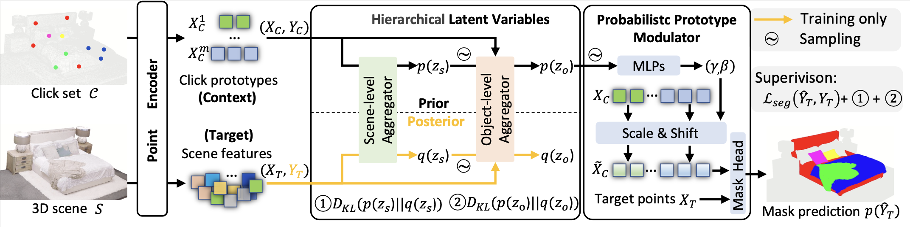
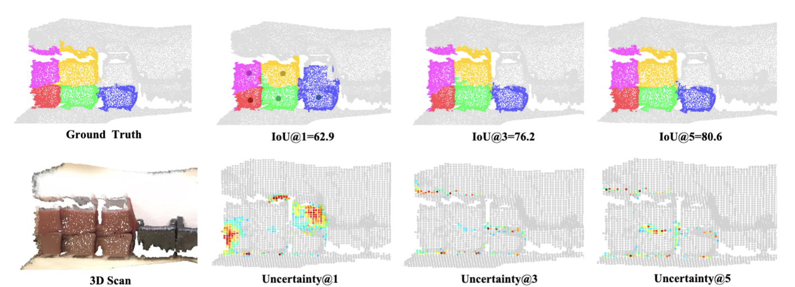

<<<<<<< HEAD
<p align="center">
<h1 align="center">NPISeg3D: Probabilistic 3D Interactive Segmentation with Hierarchical Neural Processes</h1>
<p align="center">
<a href="https://jliu4ai.github.io/"><strong>Jie Liu</strong></a>,
<a href="https://panzhous.github.io/"><strong>Pan Zhou</strong></a>,
<a href="https://zzzx1224.github.io/"><strong>Zehao Xiao</strong></a>,
<a href="https://autumn9999.github.io/"><strong>Jiayi Shen</strong></a>,
<a href="https://ywzcode.github.io//"><strong>Wenzhe Yin</strong></a>,
<a href="https://www.nki.nl/research/research-groups/jan-jakob-sonke/"><strong>Jan-Jakob Sonke</strong></a>,
<a href="https://www.egavves.com/"><strong>Efstratios Gavves</strong></a>
</p>
</p>

<p align="center">
<strong>ICML 2025</strong>
</p>

<p align="center">
<a href="https://arxiv.org/abs/2505.01726">[Paper]</a> | <a href="https://jliu4ai.github.io/NPISeg3D_projectpage/">[Project Page]</a>
</p>

<p align="center">

</p>

<p align="justify">
<strong>NPISeg3D</strong> is a novel probabilistic model for interactive 3D segmentation, which supports strong few-shot generalization and reliable uncertainty estimation. NPISeg formulate interactive 3D segmentation in the neural process frameworks, with scene-level and object-level latent variables, NPISeg3D estabilished smooth information flow from scene to objects, and then clicks. See mask and uncertainty estimation example below:
</p>
<p align="center">

</p>

## News 📢

- [2025/06/10] Initial release of the codebase
- [2025/05/01] NPISeg3D was accept in ICML 2025 🎉🎉🎉

<details open="open" style='padding: 10px; border-radius:5px 30px 30px 5px; border-style: solid; border-width: 1px;'>
  <summary>Table of Contents</summary>
  <ol>
    <li>
      <a href="#installation-hammer">Installation</a>
    </li>
    <li>
      <a href="#interactive-tool-video_game">Interactive Tool</a>
    </li>
    <li>
      <a href="#benchmark-setup-dart">Benchmark Setup</a>
    </li>
    <li>
      <a href="#training-rocket">Training</a>
    </li>
    <li>
      <a href="#evaluation-chart_with_upwards_trend">Evaluation</a>
    </li>
    <li>
      <a href="#citation-mortar_board">Citation</a>
    </li>
    <li>
      <a href="#acknowledgment-pray">Acknowledgment</a>
    </li>
  </ol>
</details>

## Installation

We follow the same [instruction](https://github.com/ywyue/AGILE3D/blob/main/installation.md) of AGILE3D to install the environment. Please follow above instruction link to install your virtual environment.

## Benchmark Setup 

We evaluate our method on several standard 3D segmentation benchmarks:
- ScanNet
- S3DIS
- KITTI-360

The processed data can be downloaded from [here](https://drive.google.com/file/d/1cqWgVlwYHRPeWJB-YJdz-mS5njbH4SnG/view?usp=sharing). Please unzip the data to the `../datasets` folder.

## Training

We train a single model in multi-object setup on ScanNet40 training set. Once trained, we evaluate the model on both multi-object and single-object setups on ScanNet40, S3DIS, KITTI-360. 

The command for training NPISeg3D with iterative training on ScanNet40 is as follows:

```shell
./scripts/train_multi.sh
```

## Evaluation 
We adopt the same evaluation strategy as in AGILE3D. If you want to run the inference and do the evaluation yourself, download the pretrained [model](https://drive.google.com/file/d/1gFcXHpOPdJoXy8yZNERNN9o1FzorMTKL/view?usp=sharing) and move it to the `weights` folder. Then run:

### Evaluation on interactive multi-object 3D segmentation:

- ScanNet40:
```shell
./scripts/eval_multi_scannet40.sh
```
- S3DIS:
```shell
./scripts/eval_multi_s3dis.sh
```
- KITTI-360:
```shell
./scripts/eval_multi_kitti360.sh
```

### Evaluation on interactive single-object 3D segmentation:

- ScanNet40:
```shell
./scripts/eval_single_scannet40.sh
```
- S3DIS:
```shell
./scripts/eval_single_s3dis.sh
```
- KITTI-360:
```shell
./scripts/eval_single_kitti360.sh
```


## Citation

If you find our work useful, please cite:

```bibtex
@article{your_paper,
  title={NPISeg3D: Probabilistic Interactive 3D Segmentation with Heirarchical Neural Processes},
  author={Jie Liu and Pan Zhou and Zehao Xiao and Jiayi Shen and Wenzhe Yin and Jan-Jakob Sonke and Efstratios Gavves},
  eprint={2505.01726},
  archivePrefix={arXiv},
  primaryClass={cs.CV},
  url={https://arxiv.org/abs/2505.01726}, 
}
```
## Acknowledgment

We sincerely thank all co-authors for their aluable contributions to this work. We are also grateful to the reviewers for their thorough review and insightful suggestions that helped improve our paper significantly.
This work builds upon [AGILE3D](https://github.com/ywyue/AGILE3D/tree/main). We would like to express our special thanks to [Yuanwen Yue](https://n.ethz.ch/~yuayue/) for his excellent work and inspiring discussions! 
